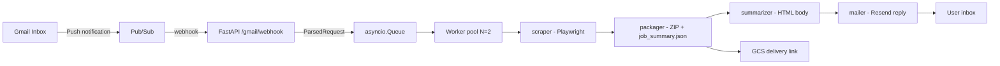

<p align="center">
  <picture>
    <source media="(prefers-color-scheme: dark)" srcset="assets/vellum_readme_header_dark.svg">
    
  </picture>
</p>

An async, event-driven agent that monitors a Gmail inbox, scrapes regulatory
filings from the Nova Scotia UARB portal, and replies with a ZIP of the
documents and a structured metadata summary.

## Using Vellum

Vellum is already running. Send an email to **vellumtheagent@gmail.com** with `[vellum]` anywhere in the subject line. The rest is free-form — put the matter number and document types in the subject or the body, however is natural.

### Examples

| What you want | Subject line |
|---|---|
| A single document type | `[vellum] Exhibits for M12205` |
| Multiple document types | `[vellum] Exhibits and Transcripts for M12205` |
| Everything on a matter | `[vellum] all documents for M12205` |
| Free-form | Subject: `[vellum] filing request` · Body: `Can you pull Exhibits and Key Documents for M12205?` |

### Document types

- Exhibits
- Key Documents
- Other Documents
- Transcripts
- Recordings

### What you get back

A reply within a few minutes containing a ZIP archive named
`vellum_<matter>_<types>_<date>.zip`, with one subfolder per requested document
type (up to 10 files each) and a `job_summary.json` with structured matter
metadata: title, status, category, dates, tab counts, and a file manifest.

If a requested tab has no documents, or the matter number is not found, you get
an error reply explaining what was attempted.

---

## Architecture



The webhook acknowledges Pub/Sub immediately and puts the job onto an
`asyncio.Queue`. A pool of worker coroutines runs the scrape-package-render-reply
pipeline, bounding concurrent Playwright sessions to avoid hammering the UARB site.

## Self-Hosting

1. Clone the repository and install dependencies:
   ```bash
   uv sync
   uv run playwright install chromium
   ```
2. Create a Google Cloud project with the Gmail API, Pub/Sub API, Cloud Run
   API, and Secret Manager API enabled. Create a Pub/Sub topic and a push
   subscription pointed at `/gmail/webhook`. Grant
   `gmail-api-push@system.gserviceaccount.com` the `roles/pubsub.publisher`
   role on the topic.
3. Create OAuth2 Desktop credentials, download them as `credentials.json`, and
   run the authorization flow once. The OAuth token needs Gmail read/watch
   access so Vellum can process inbound requests:
   ```bash
   uv run python scripts/authorize.py
   ```
4. Copy `.env.example` to `.local.env` and fill in your values.
5. Deploy to Cloud Run:
   ```bash
   bash scripts/deploy.sh
   ```
   The script builds the image, pushes it to Artifact Registry, stores
   `credentials.json` and `token.json` in Secret Manager, deploys the service,
   and updates the Pub/Sub subscription endpoint.

## Environment Variables

| Variable | Description |
|---|---|
| `GMAIL_ADDRESS` | The mailbox Vellum watches and replies from. |
| `GMAIL_CREDENTIALS_PATH` | Path to the OAuth2 client credentials JSON. |
| `GMAIL_TOKEN_PATH` | Path to the cached OAuth token (default `token.json`). |
| `PUBSUB_TOPIC` | Fully qualified Pub/Sub topic for Gmail push. |
| `PUBSUB_SUBSCRIPTION` | Fully qualified Pub/Sub push subscription. |
| `OPENAI_API_KEY` | OpenAI API key used by the email parser. |
| `OPENAI_MODEL` | Parser model (default `gpt-5.4-mini`). |
| `MAX_CONCURRENT_WORKERS` | Worker coroutines / max concurrent browsers (default 2). |
| `MAX_DOCUMENTS` | Maximum documents downloaded per tab (default 10). |
| `DOWNLOAD_TIMEOUT_MS` | Per-download timeout in milliseconds (default 30000). |
| `SCRAPER_RETRY_ATTEMPTS` | Download retry attempts (default 3). |
| `SCRAPER_RETRY_BACKOFF_S` | Backoff between retries in seconds (default 2). |
| `PARSER_MAX_CALLS_PER_MINUTE` | Rate limit for parser LLM calls (default 20). |
| `UARB_BASE_URL` | UARB portal entry URL. |
| `SELECTOR_TIMEOUT_MS` | Explicit wait timeout for selectors (default 15000). |
| `SCRAPER_HEADLESS` | Run Chromium headless (default true). |
| `EMAIL_FROM` / `EMAIL_FROM_NAME` | Reply sender address and display name. |
| `RESEND_API_KEY` | Resend API key used for outbound replies. |
| `MAILER_SEND_RETRY_ATTEMPTS` | Gmail send attempts before surfacing delivery failure (default 3). |
| `MAILER_RETRY_BASE_DELAY_S` | Base backoff for retryable mailer errors without provider retry hints (default 2). |
| `MAILER_MAX_RETRY_DELAY_S` | Maximum delay between Gmail send retries in seconds (default 900). |
| `HOST` / `PORT` | FastAPI bind address (default 0.0.0.0:8000). |

## How It Works

1. **Listener** (`agent/listener.py`) receives the Pub/Sub push, decodes the
   `historyId`, fetches new messages via the Gmail API, and extracts the sender,
   subject, and body.
2. **Parser** (`agent/parser.py`) ignores emails without the `[vellum]` subject
   tag, then uses a single LLM call to extract the matter number and document
   types. A sliding-window rate limiter caps API usage.
3. **Scraper** (`agent/scraper.py`) drives Chromium against the FileMaker
   WebDirect portal: searches the matter, extracts header metadata, parses tab
   counts, scrolls paginated lists, and intercepts each download. Empty tabs are
   non-fatal.
4. **Packager** (`agent/packager.py`) builds the ZIP with one subfolder per
   type and writes `job_summary.json`.
5. **Summarizer** (`agent/summarizer.py`) renders the HTML email body and
   subject line from the matter metadata.
6. **Storage** (`agent/storage.py`) uploads the ZIP to Cloud Storage and
   produces a temporary download link.
7. **Mailer** (`agent/mailer.py`) sends the reply through Resend with the
   download link in the HTML body.

## Monitoring Logs

Set these values for your deployment:

```bash
PROJECT_ID="your-google-cloud-project-id"
REGION="your-cloud-run-region"
SERVICE="vellum"
```

Check which Cloud Run revision is live:

```bash
gcloud run services describe "${SERVICE}" \
  --project="${PROJECT_ID}" \
  --region="${REGION}" \
  --format='table(status.latestReadyRevisionName,status.latestCreatedRevisionName,status.traffic[0].revisionName,status.traffic[0].percent)'
```

Read the latest Vellum logs:

```bash
gcloud logging read "resource.type=\"cloud_run_revision\" AND resource.labels.service_name=\"${SERVICE}\"" \
  --project="${PROJECT_ID}" \
  --limit=80 \
  --freshness=20m \
  --format='table(timestamp,resource.labels.revision_name,jsonPayload.request_id,jsonPayload.step,jsonPayload.level,jsonPayload.message,jsonPayload.matter_number,jsonPayload.document_types,jsonPayload.error_type,jsonPayload.reason)'
```

Follow one request after you have its `request_id`:

```bash
REQUEST_ID="paste-request-id-here"
gcloud logging read "resource.type=\"cloud_run_revision\" AND resource.labels.service_name=\"${SERVICE}\" AND jsonPayload.request_id=\"${REQUEST_ID}\"" \
  --project="${PROJECT_ID}" \
  --limit=200 \
  --format='table(timestamp,jsonPayload.step,jsonPayload.level,jsonPayload.message,jsonPayload.downloaded,jsonPayload.download_url,jsonPayload.error_type,jsonPayload.reason)'
```

Healthy delivery ends with:

```text
mailer.send     INFO  email sent
queue.complete  INFO  job complete
```

## Development

Run the test suite:

```bash
uv run pytest
```

Run the live scraper integration test against the UARB site:

```bash
VELLUM_LIVE_TESTS=1 uv run pytest tests/test_scraper.py
```

Exercise the full pipeline without sending email:

```bash
uv run python main.py --dry-run --matter M12205 --types "Exhibits,Transcripts"
uv run python main.py --dry-run --matter M12205 --types all
```

## What I'd Add Next

- Vector database ingestion after download, feeding `job_summary.json` and the
  raw documents into a searchable regulatory index.
- Multi-mailbox support.
- A dead-letter queue for failed jobs with automatic replay.
